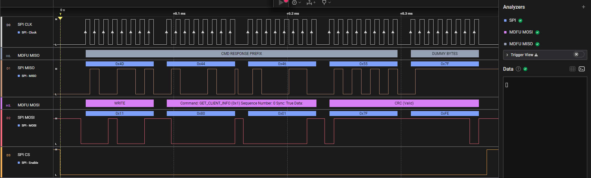

# MDFU SPI transport analyzer Saleae extension

## Getting started

The Microchip Device Firmware Update (MDFU) SPI transport analyzer decodes the traffic on the SPI bus and enables an in depth view of the protocol.

The analyzer requires a valid capture of the SPI bus traffic as input (CLK, MISO, MOSI and CS signals).

## Analyzer settings

The `Trace` setting defines whether the analyzer decodes the data on MISO or MOSI. To fully decode SPI traffic, two analyzers must be added, one to decode MOSI and the second one to decode MISO.