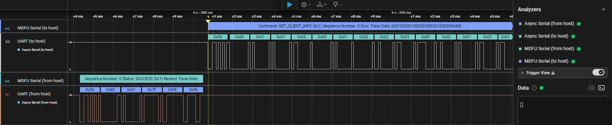
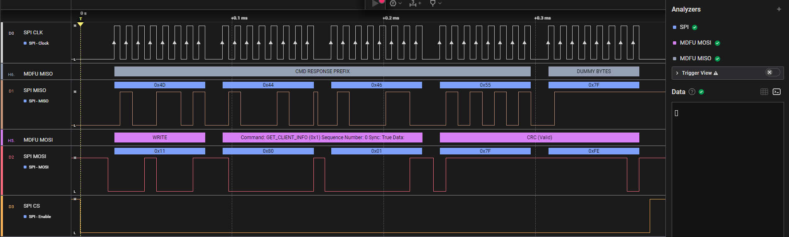
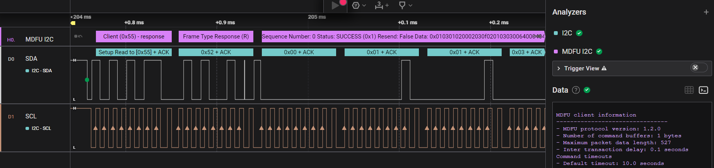

# Microchip Device Firmware Update (MDFU) Analyzers Extension for Saleae

This extension provides decoding capabilities for the Microchip Device Firmware Update (MDFU) protocol within the Saleae Logic Analyzer software. It allows users to capture, decode, and analyze MDFU traffic over various communication interfaces such as UART, SPI, and I2C. By leveraging this extension, developers and engineers can gain deeper insights into the firmware update process of Microchip devices, facilitating debugging and development tasks.

The included analyzers are:
- MDFU Serial Transport Analyzer
- MDFU SPI Transport Analyzer
- MDFU I2C Transport Analyzer

These tools are essential for developers and engineers working with Microchip devices, enabling them to gain deeper insights into the communication between the host and client during firmware updates.

## Installation
### From Saleae Extension Marketplace

In the Saleae Logic Analyzer extension view menu first check for any updates by using `Check for Updates`, then search for `MDFU Analyzers` in the list of extensions and click on install.

### From Local Repository

1. **Clone or Download the Repository:**
   - Clone the [repository](https://github.com/MicrochipTech/mdfu-saleae-analyzers) using Git or download the ZIP file in the release section and extract it to your desired location.

2. **Load the Extension in Saleae:**
   - Open the Saleae Logic Analyzer software.
   - Access the extension settings from the side panel.
   - From the context menu, select `Load Existing Extension...`.
   - Navigate to the cloned or extracted repository and select the `extension.json` file.

## Getting Started

1. **Capture MDFU Traffic:**
   - Use the Saleae Logic Analyzer to capture MDFU traffic on one of the supported transports, such as UART, SPI, or I2C.
   - Alternatively, you can open one of the sample captures available in the `capture` folder of the repository.

2. **Set up the Analyzer to decode Traffic:**
   - Detailed instructions for using the extension are available in the specific analyzer sections [MDFU serial transport analyzer](#mdfu-serial-transport-analyzer), [MDFU SPI Transport Analyzer](#mdfu-spi-transport-analyzer) and [MDFU I2C Transport Analyzer](#mdfu-i2c-transport-analyzer).

3. **Analyze the Data:**
   - Use the decoded MDFU data to analyze the firmware update process.
   - The Saleae software will display the decoded MDFU protocol data, making it easier to understand and debug the firmware update process.

## Further information

For further assistance, refer to the following resources:
- [Microchip Device Firmware Update (MDFU) Protocol Documentation](https://microchip.com/DS50003743)
- [Saleae Logic Analyzer Documentation](https://support.saleae.com/)

## MDFU serial transport analyzer

### Getting Started

The MDFU Serial Transport Analyzer is designed to decode UART traffic between an MDFU host and client. To use this analyzer effectively, you need a valid capture of the UART traffic, specifically the TX and RX signals. The analyzer setup involves two steps:
1. **Async Serial Analyzer**: First, process the UART traffic using the `Async Serial` analyzer provided by Saleae. This step converts the raw UART signals into a format that can be further analyzed.
2. **MDFU Serial Transport Analyzer**: Use the output from the `Async Serial` analyzer as input for the MDFU Serial Transport Analyzer to decode the MDFU protocol.

### Analyzer Settings

- **Trace**: This setting specifies whether the analyzer decodes traffic from the host or to the host. To fully decode the serial traffic, you need to add two instances of the MDFU Serial Transport Analyzer: one for decoding traffic from the host and another for decoding traffic to the host.

## MDFU SPI Transport Analyzer

### Getting Started

The MDFU SPI Transport Analyzer decodes traffic on the SPI bus, providing a detailed view of the MDFU protocol over SPI. This analyzer requires a valid capture of the SPI bus traffic, including the CLK, MISO, MOSI, and CS signals.

The analyzer setup involves two steps:
1. **SPI Analyzer**: First, process the UART traffic using the `SPI` analyzer provided by Saleae. This step converts the raw SPI signals into a format that can be further analyzed.
2. **MDFU SPI Analyzer**: Use the output from the `SPI` analyzer as input for the MDFU SPI Analyzer to decode the MDFU protocol.

### Analyzer Settings

- **Trace**: This setting determines whether the analyzer decodes data on the MISO (Master In Slave Out) or MOSI (Master Out Slave In) lines. To fully decode SPI traffic, you need to add two instances of the analyzer: one for decoding MOSI and another for decoding MISO.

## MDFU I2C Transport Analyzer

The MDFU I2C Transport Analyzer is designed to decode the MDFU protocol over the I2C bus. This analyzer is essential for understanding the communication between the host and client when using I2C as the transport layer.

### Getting Started

To use the MDFU I2C Transport Analyzer, you need a valid capture of the I2C bus traffic, including the SCL (clock) and SDA (data) signals. The analyzer setup involves two steps:
1. **I2C Analyzer**: First, process the I2C traffic using the `I2C` analyzer provided by Saleae. This step converts the raw I2C signals into a format that can be further analyzed.
2. **MDFU I2C Analyzer**: Use the output from the `I2C` analyzer as input for the MDFU I2C Analyzer to decode the MDFU protocol.

### Analyzer Settings

- **Debug**: This setting specifies whether the analyzer prints additional debug information in the terminal.

## Changelog

### [0.2.0] - December 2024

Initial release of the MDFU Analyzers Extension for Saleae, including support for serial, SPI, and I2C transport layers.
